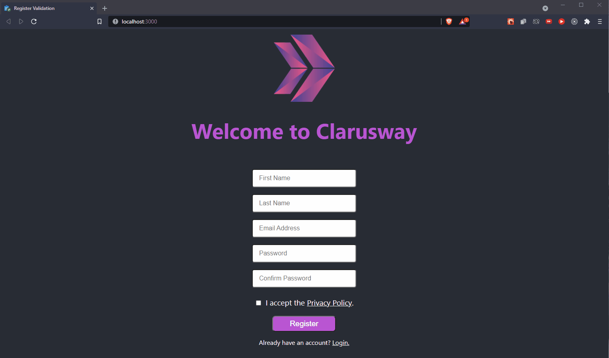

<p>Clarusway</p>

# Project-010 : Register Form Validation App (RC-10)

## Description

Project aims to create a Register Form Validation App.

## Problem Statement

- We are adding a new project to our portfolios. So you and your colleagues have started to work on the project.

## Project Skeleton

```
010 - Register Form Validation App (folder)
|
|----readme.md         # Given to the students (Definition of the project)
SOLUTION
├── public
│     └── index.html
├── src
│    ├── components
│    │       ├── form
│    │       │     ├── Form.js
│    │       │     └── formStyle.js
│    │       └── header
│    │             ├── Header.js
│    │             └── headerStyle.js
│    ├── utils
│    │     └── registerValidation.js
│    ├── App.js
│    ├── App.css
│    ├── index.js
│    └── index.css
├── package.json
└── yarn.lock
```

## Expected Outcome



## Objective

Build a Register Form Validation App using ReactJS.

### At the end of the project, following topics are to be covered;

- HTML

- CSS

- JS

- ReactJS

### At the end of the project, students will be able to;

- improve coding skills within HTML & CSS & JS & ReactJS.

- use git commands (push, pull, commit, add etc.) and Github as Version Control System.

## Steps to Solution

- Step 1 : Create React App using `npx create-react-app register-form-validation-app`

- Step 2 : Warn user for any invalid situation. Like `Fill the First Name` or `Password must contain special character!`.

- Step 3 : You can use css frameworks like Bootstrap, Semantic UI.

- Step 4 : Add project gif to your project and README.md file.

## Notes

- You can add additional functionalities to your app.

**<p align="center">&#9786; Happy Coding &#9997;</p>**
